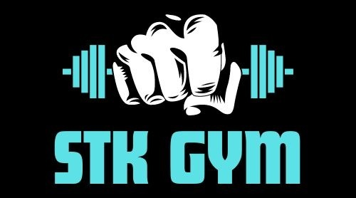

<!-- Readme -->
# Gimnasio
<div align= "center">
    <a href='https://stkgym.netlify.app/'>
    
    </a>
    <h1>GYM SKT</h1>
    <p>
     Ubicado en el microcentro de Tucumán, nuestro gimnasio ofrece modernas instalaciones con equipos de última generación, planes de entrenamiento personalizados por entrenadores expertos, y una amplia selección de proteínas y suplementos nutricionales. Con un ambiente motivador y programas grupales, es el lugar ideal para alcanzar tus objetivos de fitness y bienestar. ¡Visítanos y transforma tu vida!
    <br>
    <a href='https://stkgym.netlify.app/'>
    <strong>Explorar pagina » </strong>
    </a>
    <br>
    <br>
    <a href='https://stkgym.netlify.app/'>
    Reportar un problema
    </a>
    ·
    <a href='https://stkgym.netlify.app/'>
    Solicitar una mejora
    </a>
    </p>
</div>

## Tabla de contenido

- [💻 Sobre Gym](#💻-sobre-gym)
- [⚒️ Tecnologias](#⚒️-tecnologías-implementadas)
- [✅ Requisitos](#✅requisitos)
- [💿 Instalacion](#💿instalacion-y-uso)
- [🤝 Contribuir](#🤝como-contribuir)
- [👩‍💻 Autores](#👩‍💻-autores)
- [📞 Contactanos](#📞-contactanos)
- [📋 Licencia](#licencia)

## 💻 Sobre GYM
# Descripcion mas a fondo del proyecto

## ⚒️ Tecnologías Implementadas

| Tecnologias                           | Version |
| ------------------------------------- | ------- |
| [![HTML5-badge]][HTML-url]            | **5**   |
| [![CSS3-badge]][CSS3-url]             | **3**   |
| [![BOOTSTRAP-badge]][BOOTSTRAP-url]   | **5.3** |
| [![GitHub-badge]][GitHub-url]         | -       |
| [![javaScript-badge]][javaScript-url] | -       |
| [![Trello-badge]][Trello-url]         | -       |
| ![REACT-badge]          | -       |

## ✅Requisitos

- Windows 10 o superior
- Git
- Visual Code
- Extension "Live Server" para Visual Code

> [!IMPORTANT]
> Para que funcione el proyecto en su PC debe cumplir con **todos** los requisitos

Clonar repositorio:

```bash
git clone https://github.com/cristiandcode/Gimnasio.git
```

-Asegurarse que se encuentra la rama `main`
-Ejecutar el archivo `index.html` npm run dev
-Una vez instalada la aplicacion, la misma se pondra previsuar en el siguiente link `http://localhost:5173/`

## 🤝Como contribuir

Para contribuir, por favor seguir los siguientes pasos:

1. Hacer un Fork del repositorio y clonarlo
2. Crear desde la rama `dev` una nueva rama para comenzar `git checkout -b nueva-rama`
3. Realizar cambios y subirlos a su fork `git push origin nueva-rama`
4. Solicitar un Pull Request a la rama `dev` del repositorio original


## 👩‍💻 Autores


_Cristian Ivan Diaz_
- Github: https://github.com/cristiandcode

_Claudia Alejandra Torres_
- Github: https://github.com/Claudia604

_Iñaki Zavaleta_
- Github: https://github.com/inakizavaleta10

## 📞 Contactanos

| Medio    | Link                                    |
| -------- | --------------------------------------- |
| Email    | gym@gmail.com                   |
| Twitter  | https://twitter.com/gym        |
| Linkedin | https://www.linkedin.com/in/gym |

## Licencia

codigo y documentacion copyright 2023-2024 de los autores de GYM. Destribuido bajo la licencia de WIT. consulte el archivo LICENSE.md para obtener mas informacion.


<!-- markdown links & images -->

[HTML5-badge]: https://img.shields.io/badge/HTML5-E34F26?style=for-the-badge&logo=html5&logoColor=white
[HTML-url]: https://html.com/tags/
[CSS3-badge]: https://img.shields.io/badge/CSS3-1572B6?style=for-the-badge&logo=css3&logoColor=white
[CSS3-url]: https://www.w3.org/Style/CSS/
[BOOTSTRAP-badge]: https://img.shields.io/badge/Bootstrap-563D7C?style=for-the-badge&logo=bootstrap&logoColor=white
[BOOTSTRAP-url]: https://getbootstrap.com/
[GitHub-badge]: https://img.shields.io/badge/GitHub-100000?style=for-the-badge&logo=github&logoColor=white
[GitHub-url]: https://github.com/
[Trello-badge]: https://img.shields.io/badge/Trello-0052CC?style=for-the-badge&logo=trello&logoColor=white
[Trello-url]: https://trello.com/
[JavaScript-badge]: https://img.shields.io/badge/JavaScript-323330?style=for-the-badge&logo=javascript&logoColor=F7DF1E
[JavaScript-url]: https://www.javascript.com/
[REACT-badge]: https://img.shields.io/badge/react%20-%2320232a.svg?&style=for-the-badge&logo=react&logoColor=%2361DAFB
[REACT-URL]: https://react.dev
